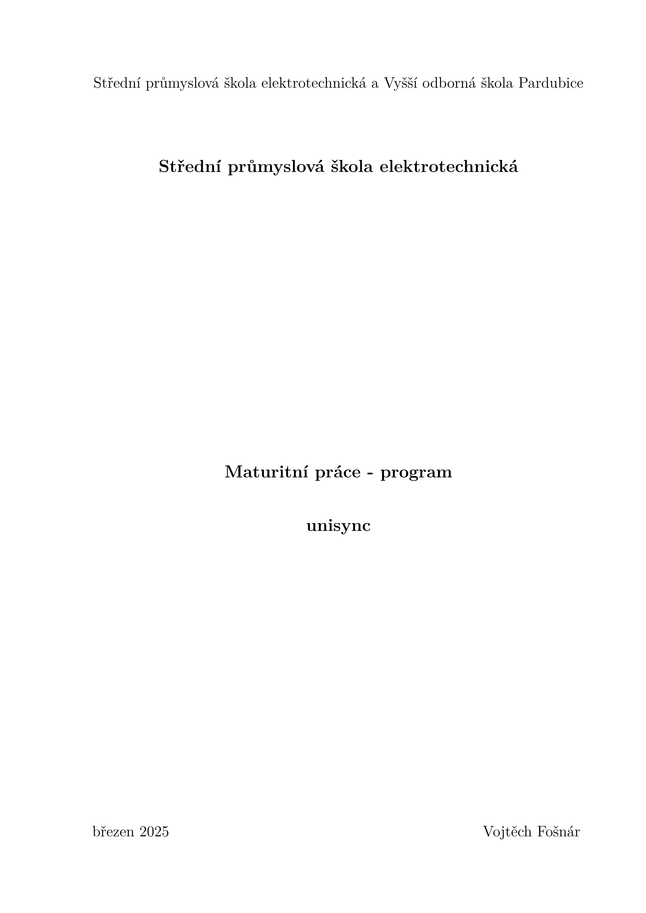
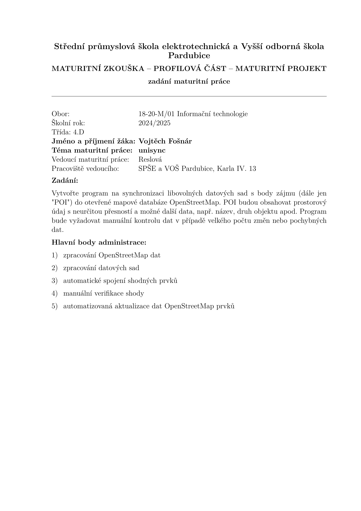

# Neoficiální LaTeX vzor maturitní práce SPŠE a VOŠ Pardubice

Dle [specifikace uvedené na stránkách školy](https://web.archive.org/web/20241007091329/https://www.spse.cz/download/zak_ss/Maturita/MP_Formalni_stranka_dokumentace.pdf).

## Ukázky stran





## Příklad

```latex
\documentclass{./maturitni-prace-latex/maturitni-prace}

\usepackage{xurl} % balíček pro lepší formátování URL pomocí příkazu \url{...}

\fullschool{Střední průmyslová škola elektrotechnická a Vyšší odborná škola Pardubice}
\school{Střední průmyslová škola elektrotechnická}
\subject{Maturitní práce - program}
\title{unisync}
\date{březen 2025}
\author{Vojtěch Fošnár}

\begin{document}

\titulnilist
\prohlaseniautora
\zadaniprace
{18-20-M/01 Informační technologie}
{2024/2025}
{4.D}
{Vojtěch Fošnár}
{unisync}
{Reslová}
{SPŠE a VOŠ Pardubice, Karla IV. 13}
{Fusce sapien lectus, scelerisque eget ultrices sit amet, rutrum in ipsum. Nunc hendrerit pharetra nulla non sollicitudin. Fusce euismod lorem non tortor luctus, et laoreet metus pellentesque. Aliquam ornare orci tortor, at vulputate neque facilisis id. Quisque ligula quam, interdum id pulvinar a, accumsan rhoncus justo. Nullam dolor arcu, pretium eget nunc vitae, posuere bibendum erat. Nullam suscipit arcu purus. Duis velit ex, aliquet at massa sed, pulvinar efficitur neque. In gravida dapibus justo a malesuada.}
{
% číslovaný seznam dle formátu '1) ', lze přizpůsobit
\begin{enumerate}[1) ]
	\item zpracování OpenStreetMap dat
	\item zpracování datových sad
	\item automatické spojení shodných prvků
	\item manuální verifikace shody
	\item automatizovaná aktualizace dat OpenStreetMap prvků
\end{enumerate}
}

% stránka s anotací
\anotace
{Anotace}
{Lorem ipsum dolor sit amet, consectetur adipiscing elit. Maecenas est augue, maximus ut orci ut, blandit dictum tortor. In ipsum risus, commodo sit amet mollis sed, efficitur et velit. Morbi faucibus erat et felis viverra, eget porttitor tortor euismod. Pellentesque pretium ultrices diam a cursus. Proin rutrum nulla in felis efficitur gravida. Suspendisse bibendum at ligula eget sollicitudin. Quisque varius ipsum sit amet nisi suscipit imperdiet. Donec aliquet eu ipsum sed ullamcorper. Phasellus mattis risus risus, eget dictum purus blandit porta. Donec tortor ante, venenatis et scelerisque eget, faucibus eu nunc.}
{Klíčová slova: OpenStreetMap, AllThePlaces, Overture Maps, synchronizace, datové sady, otevřená data, kvalita dat}

\anotace
{Annotation}
{Sed at tempus nunc. Donec eu eros at ipsum blandit rhoncus. Sed tellus purus, volutpat id vulputate eu, viverra ac lorem. Donec fermentum orci eu neque aliquet, sit amet blandit enim pharetra. Vivamus ex lectus, blandit quis maximus ac, sagittis quis velit. Donec vitae mauris blandit, auctor massa eu, lacinia sapien. Aenean bibendum, diam id cursus accumsan, tellus arcu convallis ex, in laoreet dolor dui vel purus. Pellentesque sed quam vitae lorem luctus lacinia. Aliquam sit amet convallis sem. Proin fermentum imperdiet nulla nec cursus.}
{Keywords: OpenStreetMap, AllThePlaces, Overture Maps, synchronization, datasets, open data, data quality}

% tabulka s obsahem + zapnutí číslování od další stránky
\obsah

% nečíslovaná sekce
\sekce*{Úvod}

Integer malesuada sapien finibus, commodo nisl sit amet, fringilla massa. Etiam feugiat lacinia quam, ac pretium lacus luctus et. Donec feugiat neque ut eros gravida, ut egestas nisi rhoncus. Nam iaculis tortor in tellus congue, at dignissim odio pharetra. Vivamus feugiat imperdiet nisl. Vestibulum eget ipsum sagittis, porttitor lacus in, fermentum metus. Vivamus fermentum vitae velit a pulvinar. Morbi nec consequat neque, eu pellentesque justo. Maecenas et ipsum luctus, pulvinar diam in, rhoncus neque. Maecenas eget dui tortor.

% číslovaná sekce
\sekce{Analýza obdobných projeků}

Vestibulum ante ipsum primis in faucibus orci luctus et ultrices posuere cubilia curae; Mauris mattis felis a massa blandit, et posuere purus mattis. Sed rhoncus efficitur justo vel euismod. Cras id urna id quam consequat pretium sed ut elit. Maecenas ullamcorper venenatis nibh ut luctus. Aenean finibus sapien nibh, quis iaculis magna consectetur ut. Sed felis mi, gravida malesuada dolor nec, pellentesque gravida erat. Pellentesque blandit elit vitae risus sodales commodo. In tincidunt consectetur velit nec rhoncus. Nulla et arcu sodales, finibus urna tincidunt, blandit nunc. Suspendisse metus ipsum, vehicula ac ex ac, ornare fringilla dolor. Integer porttitor magna in nunc porta gravida. Vivamus id purus odio. Suspendisse non pretium est. Class aptent taciti sociosqu ad litora torquent per conubia nostra, per inceptos himenaeos.

\podsekce{POI Importer}

Adresa: \url{https://poi-importer.github.io}

\podpodsekce{Kladné stránky}

% bodovaný seznam
\begin{itemize}
	\item Nam commodo libero
	\item Mauris congue arcu
	\item Phasellus dapibus sem
\end{itemize}
```
